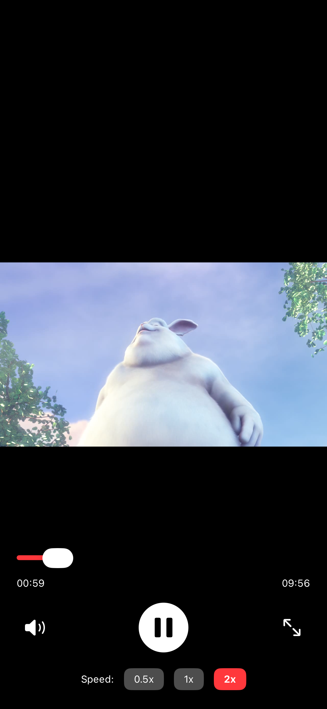
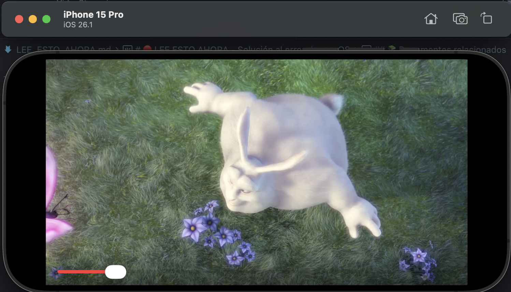

# SwiftUI Video Player

A professional video player built with SwiftUI and Clean Architecture.

## Features

✅ Remote video playback using `AVPlayer`  
✅ Custom playback controls (Play/Pause, Mute, Seek, Speed, Fullscreen)  
✅ YouTube-like control behavior (auto-hide when playing)  
✅ Automatic landscape rotation in fullscreen mode  
✅ Adaptive layout for portrait and landscape orientations  
✅ MVVM + Clean Architecture  
✅ Repository Pattern  
✅ Dependency Injection with Swinject  

## Architecture

```
📁 Domain/          # Business logic & entities
📁 Data/            # Repository implementations & services
📁 Presentation/    # Views & ViewModels
📁 Helpers/         # Utility classes (orientation management)
```

## Demo Video
<div align="center">
    <a href="https://drive.google.com/file/d/1Wt7xeUz4kXCDq_ToEogY5NDHxPVkizya/view?usp=sharing" target="_blank">
        
    </a>
    <p>Click the image to watch the demonstration video on Google Drive.</p>
</div>

### 📱 Screenshots

<div align="center">
     
</div>
<div align="center">
     
</div>
<div align="center">
     
    
</div>

**Layers:**

* **Domain**: Repository protocols, Use Cases, Models
* **Data**: Repository implementations, Remote services, DI container
* **Presentation**: SwiftUI views, ViewModels
* **Helpers**: Device rotation and orientation utilities

## Requirements

* iOS 14.0+
* Xcode 14.0+
* Swift 5.5+

## Installation

1. Clone the repository:

```bash
git clone https://github.com/a1drian5/VideoStreamingDemo.git
cd VideoStreamingDemo
```

2. Open in Xcode and add Swinject via Swift Package Manager:  
   * File → Add Package Dependencies  
   * URL: `https://github.com/Swinject/Swinject.git`  
   * Version: 2.8.0+

3. Build and run (⌘+R)

## Video Source

Uses the public Big Buck Bunny sample:

```
https://commondatastorage.googleapis.com/gtv-videos-bucket/sample/BigBuckBunny.mp4
```

## Controls

| Control           | Action                                    |
| ----------------- | ----------------------------------------- |
| **Center Button** | Play/Pause                                |
| **Left Button**   | Mute/Unmute                               |
| **Right Button**  | Fullscreen Toggle (auto-rotates device)   |
| **Slider**        | Seek/Scrub video                          |
| **Speed Buttons** | 0.5x / 1x / 2x                            |
| **Tap Screen**    | Show controls (auto-hide after 3 seconds) |

## Project Structure

```
VideoStreamingDemo/
├── Domain/
│   ├── Model/
│   │   ├── VideoItem.swift
│   │   └── PlaybackState.swift
│   ├── Repository/
│   │   └── VideoPlayerRepository.swift
│   └── UseCases/
│       └── CreateVideoPlayerUseCase.swift
├── Data/
│   ├── Remote/
│   │   └── VideoService.swift
│   ├── RepositoryImpl/
│   │   └── VideoPlayerRepositoryImpl.swift
│   └── DI/
│       └── DependencyContainer.swift
├── Presentation/
│   ├── ViewModel/
│   │   └── VideoPlayerViewModel.swift
│   ├── Screens/
│   │   └── VideoPlayerScreen.swift
│   └── Views/
│       ├── VideoControlsView.swift
│       └── CustomVideoPlayerView.swift
├── Helpers/
│   └── DeviceRotationHelper.swift
└── SwiftUIVideoPlayerApp.swift
```

## License

SwiftUI Coding Challenge

## Author

Adrian Jesus Euan Chan
